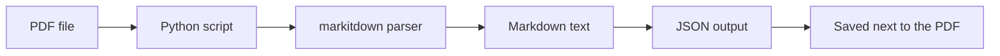

# PDF to JSON Converter


Convert a PDF into structured JSON in one command.

Latest release: [v1.0.0](https://github.com/jmsman3/PDF-to-JSON-Converter/releases/tag/v1.0.0)

This project is a lightweight **PDF to JSON converter** built in Python. It extracts text from a PDF, converts it into markdown, and saves the result in a JSON file next to the source document.

> **Start here:** clone the repo, install the dependency, place your PDF in the folder or pass the PDF path directly, then run `python extract_pdf_to_json.py`.

It is designed for people who want a simple, repeatable way to:

- extract data from PDF files
- parse PDF content in Python
- convert PDF documents into structured JSON
- build a reusable PDF parsing workflow
- use a practical PDF data extraction tool without setting up a large framework

## Why use this project?

If you need a fast and straightforward way to turn PDF files into machine-readable data, this repo gives you a clean starting point.

It is a good fit when you want:

- a minimal Python-based PDF parser
- a repeatable workflow for converting PDF to structured JSON
- an easy tool that non-technical users can run with one command
- a codebase that is simple enough to customize for your own document format
- a repo you can clone, drop your PDF into, and use immediately

## Table of Contents

- [How It Works](#how-it-works)
- [Features](#features)
- [Requirements](#requirements)
- [Installation](#installation)
- [Quick Start](#quick-start)
- [Usage](#usage)
- [Input and Output Example](#input-and-output-example)
- [Customization](#customization)
- [Troubleshooting](#troubleshooting)
- [Real-World Use Cases](#real-world-use-cases)
- [Business Use Cases](#business-use-cases)
- [CLI Reference](#cli-reference)
- [FAQ](#faq)
- [Project Structure](#project-structure)
- [Contributing](#contributing)
- [First Issue Ideas](#first-issue-ideas)
- [Roadmap to Growth](#roadmap-to-growth)
- [License](#license)
- [Code of Conduct](#code-of-conduct)
- [Security](#security)

## How It Works



The script follows a simple pipeline:

1. Read the PDF file.
2. Extract the content using `markitdown`.
3. Convert the extracted text to markdown.
4. Wrap the result in a JSON document.
5. Write the JSON file next to the original PDF.

## Features

| Feature | Description |
| --- | --- |
| PDF to JSON conversion | Convert a PDF into a structured JSON file. |
| Markdown extraction | Preserve document content in markdown form. |
| Flexible input | Use either a PDF placed beside the script or an explicit file path. |
| Auto output naming | The JSON file uses the same filename stem as the PDF. |
| Easy to customize | Adjust the schema or processing logic in a single Python file. |

## Requirements

- Python 3.11 or newer
- A virtual environment is recommended, but not required
- `markitdown`

## Installation

### Option 1: Use your existing Python environment

Install the dependency directly:

```powershell
pip install -r requirements.txt
```

### Option 2: Use the included virtual environment on Windows

```powershell
.\.venv\Scripts\Activate.ps1
pip install -r requirements.txt
```

> If your system blocks script execution, you may need to allow PowerShell scripts or use a different shell.

## Quick Start

1. Clone or download this repository.
2. Put your PDF file in the repo folder, or note the full path to your PDF.
3. Install the dependency.
4. Run the script.
5. Open the generated JSON file.

## Setup & Configuration

If you are setting up the repo for the first time, use this exact workflow:

| Step | What to do | Why it matters |
| --- | --- | --- |
| 1 | Install Python 3.11+ | The script runs on a modern Python environment. |
| 2 | Install dependencies with `pip install -r requirements.txt` | This installs `markitdown` and required packages. |
| 3 | Place one PDF in the repo folder, or keep the PDF anywhere and pass the full path | This is the input file the converter will process. |
| 4 | Run `python extract_pdf_to_json.py` or `python extract_pdf_to_json.py "D:\\ParasePDF\\your-document.pdf"` | This performs the PDF to JSON conversion. |
| 5 | Open the generated JSON next to the source PDF | This is the output you can reuse in CRM, automation, or analysis. |

### Configuration options at a glance

| Option | Default behavior | How to change it |
| --- | --- | --- |
| Input PDF | Uses the only `.pdf` file in the repo folder | Pass the PDF path explicitly on the command line |
| Output JSON | Saved next to the PDF with the same filename stem | Edit `extract_pdf_to_json.py` if you want a custom output folder |
| Dependencies | Installed from `requirements.txt` | Update `requirements.txt` if you add more packages |
| Virtual environment | Optional but recommended | Use `.\.venv\Scripts\Activate.ps1` on Windows |

This section is the fastest way to configure the repo for your own PDF file.

## Usage

There are two supported workflows.

### 1) Automatic mode: keep one PDF in the folder

If there is exactly one `.pdf` file in the same folder as `extract_pdf_to_json.py`, run:

```powershell
python extract_pdf_to_json.py
```

The script will automatically find that PDF and create a JSON file with the same name.

### 2) Explicit mode: pass your PDF path

If you want to parse a specific PDF, pass the file path directly:

```powershell
python extract_pdf_to_json.py "D:\ParasePDF\my-document.pdf"
```

This is the best option when:

- you keep multiple PDFs in the same folder
- you want to process a file outside the repo
- you want a fully explicit command for automation or scripting

## Input and Output Example

### Example input

Any PDF file you provide, such as `your-document.pdf`

### Example output

`examples/sample-output.json`

### Example JSON structure

```json
{
	"source": "D:\\ParasePDF\\your-document.pdf",
	"title": "Sample Document",
	"markdown": "# Sample Document\n\nExtracted content goes here..."
}
```

The `markdown` field contains the extracted document text in markdown format, which makes it easier to search, transform, or feed into another pipeline.

## Customization

This project is intentionally small, which makes it easy to adapt.

### Change the output schema

If you want more fields in the JSON file, edit the `payload` dictionary in `extract_pdf_to_json.py`.

For example, you could add:

- file size
- page count
- processing timestamp
- document category
- extracted tables or metadata

### Change the output location

Right now, the script writes the JSON file next to the PDF using the same filename stem.

If you want a dedicated output folder, update the `output_json` path in the script.

### Process multiple PDFs

If you want batch processing, you can extend the script to loop through a folder and convert every `.pdf` file.

### Improve the downstream pipeline

After conversion, you can add your own logic for:

- cleaning text
- normalizing spacing
- splitting records
- extracting structured fields
- sending the JSON to another app or database

<details>
<summary>Advanced customization ideas</summary>

- add command-line flags for output folders
- add filters for specific page ranges
- detect and tag tables or sections
- generate one JSON file per page
- add logging for batch processing

</details>

## Troubleshooting

### The script says it cannot find a PDF

Make sure one of these is true:

- there is exactly one `.pdf` file in the same folder as `extract_pdf_to_json.py`
- or you passed a valid PDF path on the command line

### I have multiple PDFs in the folder

That is supported, but you must pass the PDF path explicitly:

```powershell
python extract_pdf_to_json.py "D:\ParasePDF\my-document.pdf"
```

### `markitdown` is not installed

Install it with:

```powershell
pip install markitdown
```

### PowerShell blocks the virtual environment activation script

If `Activate.ps1` is blocked, you can either:

- use the system Python directly, or
- adjust your PowerShell execution policy for your local machine

### The output looks incomplete

Some PDFs contain scanned pages, images, or unusual formatting. In those cases, extraction quality depends on the source file.

## Real-World Use Cases

This repository can help with many practical PDF parsing workflows:

- converting membership directories into searchable JSON
- extracting meeting documents into structured text
- archiving reports in a machine-readable format
- preparing PDF content for search indexing
- building a base for an AI PDF parser or document-processing pipeline
- turning public PDFs into data that can be analyzed later

## Business Use Cases

This tool is also useful for sales, operations, and business automation workflows where PDF documents need to become structured data.

- converting sales lead PDFs into JSON for CRM import
- extracting contact details from vendor lists and partner directories
- turning event attendee sheets into structured records
- processing inquiry forms for faster follow-up
- converting product brochures or catalogs into searchable data
- preparing document data for dashboards, automation, or reporting

If your team still copies information from PDFs by hand, this project can reduce repetitive work and make the data easier to reuse.

## CLI Reference

### Command

```powershell
python extract_pdf_to_json.py [pdf_path]
```

### Arguments

| Argument | Required | Description |
| --- | --- | --- |
| `pdf_path` | No | Optional path to the PDF file you want to convert. |

### Behavior

- If `pdf_path` is provided, that file is processed.
- If `pdf_path` is omitted and there is exactly one `.pdf` file next to the script, that file is processed automatically.
- If multiple PDFs exist and no path is provided, the script asks you to choose explicitly.

## FAQ

### Is this an AI PDF parser?

Not in the large-language-model sense. It is a deterministic PDF parsing tool that extracts content into markdown and JSON. That makes it reliable, lightweight, and easy to automate.

### Can I use it for my own PDF files?

Yes. Replace the PDF file in the folder or pass your own file path when running the script.

### Can I use it in another project?

Yes. You can copy the script, adapt the JSON schema, or embed the logic into a larger document-processing pipeline.

### Does it work with any PDF?

It works best with text-based PDFs. Scanned or image-only PDFs may require OCR for better results.

## Project Structure

Generated PDFs and JSON outputs are treated as local artifacts and are ignored by Git. The only committed example data file is the sanitized sample output in `examples/`.

```text
ParasePDF/
├─ .gitignore
├─ CONTRIBUTING.md
├─ LICENSE
├─ extract_pdf_to_json.py
├─ README.md
├─ examples/
│  └─ README.md
├─ requirements.txt
├─ your-document.pdf   # local-only
└─ your-document.json  # generated locally
```

## Getting Help

If you are new to Python, the simplest workflow is:

1. Put your PDF file in the repository folder, or use a sample PDF for testing.
2. Install `markitdown`.
3. Run `python extract_pdf_to_json.py`.
4. Open the JSON file that appears next to the PDF.

That is the intended "replace the PDF and run one command" experience.

## Public Repository Guidance

For an open-source repository, the safest and most professional pattern is to keep example files sanitized.

- Use a small sample PDF or a public-domain document.
- Avoid committing private, copyrighted, or sensitive PDFs.
- Keep one sample JSON output in the repo to demonstrate the format.
- Tell users to replace the sample PDF with their own document.

## Contributing

Contributions are welcome.

Good first improvements include:

- support for batch PDF conversion
- custom output folders
- page-range filtering
- richer metadata in the JSON output
- OCR support for scanned PDFs

If you want to contribute:

1. Fork the repository.
2. Create a feature branch.
3. Make your changes.
4. Test the script with a sample PDF.
5. Open a pull request with a short description of the change.

## First Issue Ideas

If you want to make your first contribution, these are good starter tasks:

- add a `--output-dir` command-line option
- add support for batch-processing multiple PDFs in a folder
- add page-range filtering for partial PDF conversion
- improve error messages for missing files or invalid paths
- add OCR support notes for scanned PDFs
- add a small sample screenshot or JSON preview to the README
- improve metadata in the generated JSON payload

These are intentionally small, practical improvements that are easy to review and helpful to real users.

## Roadmap to Growth

The best way to grow this repo gradually is to keep the project useful, visible, and easy to share.

### Phase 1: Make the first impression strong

- keep the README clear and simple
- keep the repo public-safe and easy to run
- show one sample output file and one business use case
- keep the top section focused on the main value

### Phase 2: Add useful features

- add batch conversion for multiple PDFs
- add output folder support
- add page-range selection
- add OCR support notes for scanned PDFs
- improve JSON metadata for downstream automation

### Phase 3: Build contributor momentum

- label small starter issues clearly
- reply quickly to issues and pull requests
- keep the contributing guide simple
- add a changelog or release notes for each version

### Phase 4: Increase visibility

- post the repo on LinkedIn, X, and relevant dev communities
- share real use cases like sales lead PDFs or contact lists
- add screenshots or short demos
- ask users to star, fork, and give feedback

### Phase 5: Keep the repo active

- ship small updates regularly
- close stale issues politely
- improve docs when users get confused
- add new examples based on real feedback

The goal is steady, useful growth rather than trying to go viral overnight.

## License

This project is released under the [MIT License](LICENSE).

## Code of Conduct

Please review the [Code of Conduct](CODE_OF_CONDUCT.md) before contributing.

## Security

Please review the [Security Policy](SECURITY.md) before reporting issues involving sensitive documents or private data.